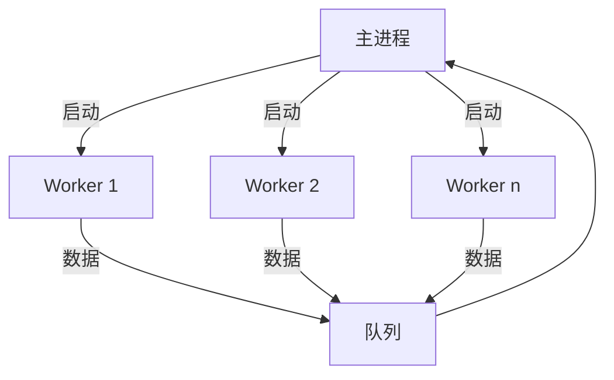

# 模型训练步骤及方法

# 1.处理数据集

## 1.TensorDataset 类

`TensorDataset` 是 PyTorch 中一个简单但实用的数据集封装类，用于将多个张量组合成一个数据集对象。它特别适用于处理内存中可以直接加载的数据（如 NumPy 数组或 PyTorch 张量）。

### 基本概念

`TensorDataset` 允许你将多个张量（例如特征张量和标签张量）打包成一个数据集对象，这些张量的第一个维度（样本数量）必须相同。

#### 创建 TensorDataset

```python
import torch
from torch.utils.data import TensorDataset, DataLoader

# 创建样本特征张量 (100个样本，每个样本5个特征)
features = torch.randn(100, 5)

# 创建标签张量 (100个样本)
labels = torch.randint(0, 2, (100,))

# 创建 TensorDataset
dataset = TensorDataset(features, labels)
```

#### 核心功能与方法

##### 1. 访问数据

```python
# 访问单个样本
sample_idx = 0
single_sample = dataset[sample_idx]
print(single_sample)  # 输出: (tensor([...]), tensor(...))

# 获取样本数量
num_samples = len(dataset)
print(f"数据集包含 {num_samples} 个样本")
```


##### 2. 与 DataLoader 配合使用

```python
# 创建 DataLoader
dataloader = DataLoader(dataset, 
                        batch_size=16, 
                        shuffle=True, 
                        num_workers=2)

# 迭代批次数据
for batch_idx, (batch_features, batch_labels) in enumerate(dataloader):
    print(f"批次 {batch_idx}:")
    print(f"特征形状: {batch_features.shape}")
    print(f"标签形状: {batch_labels.shape}")
    # 在此处添加模型训练代码
```


##### 3. 添加额外张量

```python
# 添加样本ID张量
sample_ids = torch.arange(100)

# 创建包含多个张量的数据集
multi_tensor_dataset = TensorDataset(features, labels, sample_ids)

# 访问数据
print(multi_tensor_dataset[0])  # (features, label, id)
```


##### 4. 数据切片

```python
# 切片访问
subset = multi_tensor_dataset[10:20]  # 获取第10到19个样本

# 使用索引列表
indices = [2, 4, 6, 8]
selected_samples = [dataset[i] for i in indices]
```

#### 常用函数详解

##### `TensorDataset` 构造函数

```python
TensorDataset(*tensors)
```

- **参数**：一个或多个张量
- **要求**：所有张量的第一个维度大小必须相同（即样本数量相同）
- **功能**：创建一个包含这些张量的数据集

##### `__getitem__` 方法

```python
dataset[index]
```

- **参数**：整数索引或切片对象
- **返回值**：包含所有张量在对应位置的元素的元组

##### `__len__` 方法

```python
len(dataset)
```

- **返回值**：数据集中样本的数量（即所有张量的第一个维度大小）

#### 优缺点分析

##### 优点：

1. **简单易用**：对于内存中的数据，创建和使用非常直观
2. **高效**：直接操作张量，没有额外的数据加载开销
3. **灵活**：可以组合任意数量的张量
4. **兼容性好**：与PyTorch的DataLoader无缝集成

##### 缺点：

1. **内存限制**：所有数据必须能放入内存
2. **不适合大型数据集**：对于非常大的数据集（如图像数据集）可能不适用
3. **缺乏动态处理**：不支持按需加载或动态数据增强（除非自定义子类）

#### 最佳实践

1. **数据预处理**：在创建TensorDataset之前完成所有预处理
2. **类型转换**：确保张量类型正确（如float32用于特征，long用于标签）
3. **设备转移**：在模型训练前将数据转移到GPU
4. **组合使用**：对于复杂场景，考虑与`ConcatDataset`或`Subset`结合使用

#### 替代方案

当数据不适合完全加载到内存时，考虑使用：

1. **自定义Dataset类**：继承`torch.utils.data.Dataset`
2. **IterableDataset**：用于流式数据或大型数据集
3. **第三方库**：如PyTorch Lightning的`LightningDataModule`

`TensorDataset`是PyTorch数据管道中最简单直接的解决方案，特别适合中小规模数据集和快速原型开发。掌握其使用方法能有效提升数据处理的效率。

### **2.IterableDataset**类（待补充）

### 3.DataLoader 类

DataLoader 是 PyTorch 中用于高效数据加载的核心组件，它提供了批处理、数据打乱、并行加载等功能，极大简化了深度学习中的数据管理流程。下面我将全面讲解 DataLoader 的设计原理、核心功能和高级用法。

#### 设计理念与核心功能

DataLoader 的核心目标是解决深度学习中的**数据供给瓶颈**问题，通过以下设计实现高效数据加载：

1. **批处理**：将多个样本组合成批次，提高计算效率
2. **并行加载**：使用多进程预取数据，减少等待时间
3. **内存优化**：按需加载数据，避免一次性占用过多内存
4. **灵活扩展**：支持自定义数据集、采样器和批处理逻辑

#### 基本使用方式

```python
import torch
from torch.utils.data import DataLoader, TensorDataset

# 1. 创建示例数据集
features = torch.randn(1000, 64)  # 1000个样本，每个64维
labels = torch.randint(0, 10, (1000,))  # 1000个标签
dataset = TensorDataset(features, labels)

# 2. 创建DataLoader
dataloader = DataLoader(
    dataset,
    batch_size=32,      # 每批样本数
    shuffle=True,       # 是否打乱数据
    num_workers=4,      # 并行加载进程数
    pin_memory=True,    # 启用GPU内存固定
    drop_last=False     # 是否丢弃最后不足批次的数据
)

# 3. 使用DataLoader
for epoch in range(3):
    print(f"Epoch {epoch+1}")
    for batch_idx, (inputs, targets) in enumerate(dataloader):
        # 训练代码...
        print(f"Batch {batch_idx}: inputs={inputs.shape}, targets={targets.shape}")
```

#### 核心参数详解

##### 1. 基础参数

| 参数          | 默认值 | 说明                                              |
| ------------- | ------ | ------------------------------------------------- |
| `dataset`     | 必需   | 数据集对象（必须实现 `__len__` 和 `__getitem__`） |
| `batch_size`  | 1      | 每批样本数量                                      |
| `shuffle`     | False  | 是否在每个epoch开始时打乱数据                     |
| `num_workers` | 0      | 数据加载子进程数（0=主进程加载）                  |
| `pin_memory`  | False  | 是否将数据固定到GPU内存（加速GPU传输）            |
| `drop_last`   | False  | 是否丢弃最后不足批次的数据                        |

##### 2. 高级参数

| 参数                 | 默认值 | 说明                                   |
| -------------------- | ------ | -------------------------------------- |
| `sampler`            | None   | 自定义采样器（与shuffle互斥）          |
| `batch_sampler`      | None   | 自定义批次采样器（与batch_size等互斥） |
| `collate_fn`         | None   | 自定义批处理函数                       |
| `prefetch_factor`    | 2      | 每个worker预取的批次数                 |
| `persistent_workers` | False  | 是否维持工作进程（减少进程创建开销）   |
| `timeout`            | 0      | 数据加载超时时间（秒）                 |
| `worker_init_fn`     | None   | 工作进程初始化函数                     |

#### 核心组件解析

##### 1. 采样器（Sampler）

DataLoader 使用采样器确定数据加载顺序：

```python
from torch.utils.data import RandomSampler, SequentialSampler

# 随机采样器（相当于shuffle=True）
random_sampler = RandomSampler(dataset, replacement=False, num_samples=None)

# 顺序采样器（相当于shuffle=False）
sequential_sampler = SequentialSampler(dataset)

# 自定义采样器（例如：只取偶数索引样本）
class EvenIndexSampler(torch.utils.data.Sampler):
    def __init__(self, data_source):
        self.data_source = data_source
    
    def __iter__(self):
        return iter(range(0, len(self.data_source), 2)
    
    def __len__(self):
        return len(self.data_source) // 2

# 使用自定义采样器
dataloader = DataLoader(dataset, sampler=EvenIndexSampler(dataset))
```


##### 2. 批处理函数（collate_fn）

```python
# 处理不等长序列
def collate_padded_sequences(batch):
    # batch是列表 [(input1, label1), ...]
    inputs = [item[0] for item in batch]
    labels = [item[1] for item in batch]
    
    # 对序列进行填充
    padded_inputs = torch.nn.utils.rnn.pad_sequence(
        inputs, batch_first=True, padding_value=0
    )
    
    # 获取原始长度（用于RNN）
    lengths = torch.tensor([len(seq) for seq in inputs])
    
    return padded_inputs, lengths, torch.stack(labels)

# 使用自定义批处理函数
dataloader = DataLoader(
    dataset, 
    batch_size=16,
    collate_fn=collate_padded_sequences
)
```


##### 3. 多进程加载（num_workers）

 工作原理：

1. 主进程创建 `num_workers` 个子进程
2. 每个子进程独立加载数据
3. 使用队列将数据传输到主进程




#### 高级用法

##### 1. 分布式训练支持

```python
import torch.distributed as dist
from torch.utils.data.distributed import DistributedSampler

# 初始化分布式环境
dist.init_process_group(backend='nccl')

# 创建分布式采样器
dist_sampler = DistributedSampler(
    dataset,
    num_replicas=dist.get_world_size(),  # 总进程数
    rank=dist.get_rank(),                 # 当前进程ID
    shuffle=True
)

# 分布式DataLoader
dist_loader = DataLoader(
    dataset,
    batch_size=64,
    sampler=dist_sampler,
    num_workers=4,
    pin_memory=True
)
```


##### 2. 数据增强集成

```python
from torchvision import transforms

# 定义训练和验证的不同变换
train_transform = transforms.Compose([
    transforms.RandomHorizontalFlip(),
    transforms.RandomRotation(15),
    transforms.ToTensor(),
])

val_transform = transforms.Compose([
    transforms.ToTensor(),
])

# 在Dataset中应用变换
class CustomDataset(torch.utils.data.Dataset):
    def __init__(self, data, transform=None):
        self.data = data
        self.transform = transform
    
    def __len__(self):
        return len(self.data)
    
    def __getitem__(self, idx):
        item = self.data[idx]
        
        if self.transform:
            item = self.transform(item)
        
        return item

# 创建不同变换的数据加载器
train_loader = DataLoader(
    CustomDataset(train_data, transform=train_transform),
    batch_size=64,
    shuffle=True
)

val_loader = DataLoader(
    CustomDataset(val_data, transform=val_transform),
    batch_size=128,
    shuffle=False
)
```


##### 3. 流式数据处理

```python
from torch.utils.data import IterableDataset

class StreamDataset(IterableDataset):
    def __init__(self, data_stream):
        self.data_stream = data_stream
    
    def __iter__(self):
        for item in self.data_stream:
            # 实时处理数据
            processed = self.process_item(item)
            yield processed
    
    def process_item(self, item):
        # 数据预处理逻辑
        return torch.tensor(item)

# 模拟数据流
def data_stream():
    while True:  # 无限流
        yield np.random.rand(64)  # 模拟数据生成

# 创建流式DataLoader
stream_loader = DataLoader(
    StreamDataset(data_stream()),
    batch_size=32,
    num_workers=2
)

# 使用流式加载器
for batch in stream_loader:
    # 训练模型...
    pass
```

#### 性能优化技巧

##### 1. 加速数据加载

```python
optimized_loader = DataLoader(
    dataset,
    batch_size=256,           # 增大批次大小
    shuffle=True,
    num_workers=8,            # 设置为CPU核心数
    pin_memory=True,          # 启用GPU内存固定
    prefetch_factor=4,        # 增加预取批次
    persistent_workers=True,  # 维持工作进程
    multiprocessing_context='spawn'  # 更快的启动方式
)
```


##### 2. 内存优化策略

 

```python
optimized_loader = DataLoader(
    dataset,
    batch_size=256,           # 增大批次大小
    shuffle=True,
    num_workers=8,            # 设置为CPU核心数
    pin_memory=True,          # 启用GPU内存固定
    prefetch_factor=4,        # 增加预取批次
    persistent_workers=True,  # 维持工作进程
    multiprocessing_context='spawn'  # 更快的启动方式
)
```


##### 3. 混合精度训练集成

 

```python
from torch.cuda import amp

scaler = amp.GradScaler()

for inputs, labels in dataloader:
    inputs = inputs.to('cuda', non_blocking=True)
    labels = labels.to('cuda', non_blocking=True)
    
    with amp.autocast():
        outputs = model(inputs)
        loss = criterion(outputs, labels)
    
    scaler.scale(loss).backward()
    scaler.step(optimizer)
    scaler.update()
    optimizer.zero_grad()
```

#### 常见问题与解决方案

##### 问题1：数据加载成为瓶颈

**解决方案**：

1. 增加 `num_workers`（推荐设置为CPU核心数）
2. 启用 `pin_memory=True`（GPU训练时）
3. 使用更快的存储（如NVMe SSD）
4. 增加 `prefetch_factor`

##### 问题2：多进程错误

**解决方案**：

```python
# 正确封装代码
if __name__ == '__main__':
    main()

# 设置合适的multiprocessing_context
dataloader = DataLoader(
    dataset,
    num_workers=4,
    multiprocessing_context='spawn'
)

# 避免在Dataset中使用全局变量
```

##### 问题3：内存泄漏

**解决方案**：

1. 使用 `persistent_workers=True` 减少进程创建
2. 定期重启训练进程
3. 监控GPU内存使用情况
4. 减少 `prefetch_factor`

##### 问题4：数据顺序不一致

**解决方案**：

```python
# 设置随机种子
def seed_worker(worker_id):
    worker_seed = torch.initial_seed() % 2**32
    np.random.seed(worker_seed)
    random.seed(worker_seed)

dataloader = DataLoader(
    dataset,
    batch_size=64,
    shuffle=True,
    num_workers=4,
    worker_init_fn=seed_worker,
    generator=torch.Generator().manual_seed(42)
)
```

## 2.模型定义

